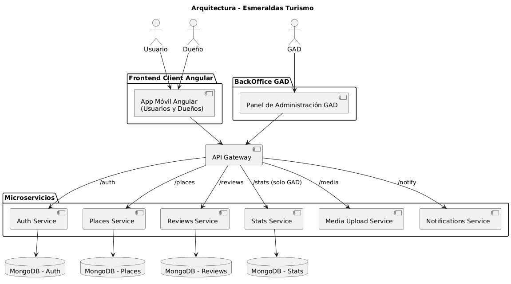
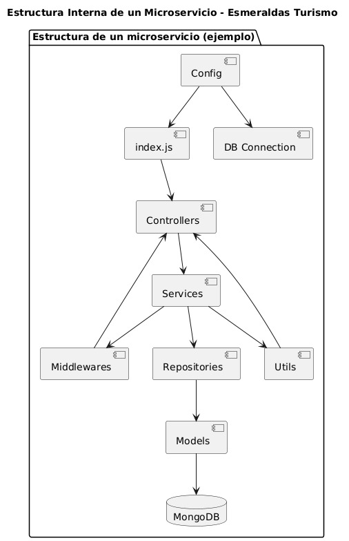

# 🏝️ Esmeraldas Turismo - Microservicios (Auth & Places)

Este repositorio contiene los microservicios principales del sistema "Esmeraldas Turismo" desarrollados en Node.js con Express y MongoDB.

---

## 🏗️ Arquitectura del Sistema

### Arquitectura Completa



### Estructura de Microservicios



---

# 🔐 Auth Service

Microservicio de autenticación para el sistema "Esmeraldas Turismo".

## 🚀 Características

- **Autenticación JWT**: Tokens seguros con expiración configurable
- **Roles de usuario**: Soporte para `usuario`, `propietario` y `gad`
- **Hash de contraseñas**: Encriptación con bcrypt
- **Validación robusta**: Validación de datos con express-validator
- **Arquitectura modular**: Separación clara de responsabilidades
- **Manejo de errores**: Sistema centralizado de manejo de errores
- **CORS configurado**: Soporte para peticiones cross-origin
- **Logging**: Registro de todas las peticiones

## 📁 Estructura del Proyecto (Auth)

```
backend/
├── controllers/
│   └── authController.js
├── services/
│   └── authService.js
├── middlewares/
│   ├── auth.js
│   ├── validation.js
│   └── errorHandler.js
├── repositories/
│   └── userRepository.js
├── models/
│   └── User.js
├── utils/
│   ├── jwt.js
│   └── response.js
├── routes/
│   └── auth.js
├── db/
│   └── connection.js
```

## 🛠️ Instalación (General)

1. **Instalar dependencias**
   ```bash
   cd backend
   npm install
   ```
2. **Configurar variables de entorno**
   ```env
   PORT=3001
   NODE_ENV=development
   MONGODB_URI=mongodb://localhost:27017/turismoDB
   JWT_SECRET=tu_jwt_secret_super_seguro_aqui
   JWT_EXPIRES_IN=24h
   CORS_ORIGIN=http://localhost:3000, http://localhost:4200
   ```
3. **Iniciar MongoDB**
4. **Ejecutar el servidor**
   ```bash
   npm run dev
   # o
   npm start
   ```

## 📡 Endpoints (Auth)

### Rutas Públicas

- `POST /auth/register` - Registro de usuario
- `POST /auth/login` - Autenticación
- `GET /auth/validate` - Validación de token
- `GET /auth/health` - Estado del servicio

### Rutas Protegidas

- `GET /auth/profile` - Obtener perfil
- `PUT /auth/profile` - Actualizar perfil
- `DELETE /auth/profile` - Eliminar usuario
- `PUT /auth/change-password` - Cambiar contraseña

## 🧪 Pruebas (Auth)
=======

### Rutas Administrativas (solo GAD)
- `GET /auth/users` - Listar todos los usuarios activos
- `DELETE /auth/users/:id` - Eliminar usuario (eliminación física)

## 🧪 Pruebas

Para probar todas las funcionalidades del microservicio, consulta el archivo:
**[Postman_Collection.md](./backend/Postman_Collection.md)**

---

# 📍 Places Service

Microservicio de gestión de lugares turísticos para el sistema "Esmeraldas Turismo".

## 🚀 Características
=======
  - Solo el rol `gad` puede acceder a los endpoints administrativos de usuarios.

### Middlewares de Autorización
```javascript
// Verificar autenticación
import { autenticarToken } from './middlewares/auth.js';
>>>>>>> 184db219c3ce61055ea39b242308b0e7b8b665aa

- **CRUD completo de lugares turísticos**
- **Paginación, filtrado y orden dinámico**
- **Validación robusta**: express-validator
- **Arquitectura modular**
- **Manejo de errores centralizado**
- **CORS configurado**
- **Logging de peticiones**

## 📁 Estructura del Proyecto (Places)

```
backend/
├── controllers/
│   └── placeController.js
├── services/
│   └── placeService.js
├── middlewares/
│   ├── placeValidation.js
│   └── errorHandler.js
├── models/
│   └── Place.js
├── routes/
│   └── place.js
```

## 📡 Endpoints (Places)

### Rutas Públicas

- `GET /places/health` - Estado del servicio
- `GET /places` - Listar lugares (con paginación, filtro y orden)
- `GET /places/:id` - Obtener lugar por ID

### Rutas de Gestión

- `POST /places` - Crear lugar
- `PUT /places/:id` - Actualizar lugar
- `DELETE /places/:id` - Eliminar lugar

## 🧪 Pruebas (Places)

Para probar todas las funcionalidades del microservicio, consulta el archivo:
**[Postman_Collection_Places.md](./backend/Postman_Collection_Places.md)**

---

# 🗄️ Modelos de Base de Datos

## Auth - Colección: `users`

```javascript
{
  _id: ObjectId,
  nombre: String,           // Requerido, 2-50 caracteres
  correo: String,           // Requerido, único, email válido
  contraseña: String,       // Requerido, hasheada con bcrypt
  rol: String,              // Enum: 'usuario', 'propietario', 'gad'
  activo: Boolean,          // Default: true
  fechaCreacion: Date,      // Default: Date.now
  ultimoAcceso: Date,       // Default: Date.now
  createdAt: Date,          // Timestamp automático
  updatedAt: Date           // Timestamp automático
}
```
- **Eliminación física:** Cuando se elimina un usuario desde el panel de administración, se borra completamente de la base de datos.

## Places - Colección: `places`

```javascript
{
  _id: ObjectId,
  name: String,         // Requerido
  description: String,  // Requerido
  location: String,     // Requerido
  category: String,     // Ej: 'natural', 'histórico', etc.
  images: [String],     // URLs de imágenes
  active: Boolean,      // Default: true
  createdAt: Date,      // Timestamp automático
  updatedAt: Date       // Timestamp automático
}
```

---

# 🔧 Configuración

### Variables de Entorno

| Variable         | Descripción                                | Default                               |
| ---------------- | ------------------------------------------ | ------------------------------------- |
| `PORT`           | Puerto del servidor                        | `3001`                                |
| `NODE_ENV`       | Entorno de ejecución                       | `development`                         |
| `MONGODB_URI`    | URI de conexión a MongoDB                  | `mongodb://localhost:27017/turismoDB` |
| `JWT_SECRET`     | Clave secreta para JWT (solo Auth)         | `default_secret_change_in_production` |
| `JWT_EXPIRES_IN` | Tiempo de expiración del token (solo Auth) | `24h`                                 |
| `CORS_ORIGIN`    | Origen permitido para CORS                 | `http://localhost:3000`               |
=======
| Variable | Descripción | Default |
|----------|-------------|---------|
| `PORT` | Puerto del servidor | `3001` |
| `NODE_ENV` | Entorno de ejecución | `development` |
| `MONGODB_URI` | URI de conexión a MongoDB | `mongodb://localhost:27017/turismoDB` |
| `JWT_SECRET` | Clave secreta para JWT | `default_secret_change_in_production` |
| `JWT_EXPIRES_IN` | Tiempo de expiración del token | `24h` |
| `CORS_ORIGIN` | Origen permitido para CORS | `http://localhost:3000, http://localhost:4200` |

## 🚀 Despliegue

### Docker (Recomendado)
```dockerfile
FROM node:18-alpine

WORKDIR /app

COPY package*.json ./
RUN npm ci --only=production

COPY . .

EXPOSE 3001

CMD ["npm", "start"]
```
>>>>>>> 184db219c3ce61055ea39b242308b0e7b8b665aa

### Variables de Producción

```env
NODE_ENV=production
JWT_SECRET=tu_jwt_secret_super_seguro_y_complejo_aqui
MONGODB_URI=mongodb://tu-servidor-mongodb:27017/turismoDB
```

---

# 🔒 Seguridad

- **Contraseñas hasheadas** (Auth): Uso de bcrypt con salt de 12 rondas
- **JWT seguro** (Auth): Tokens con issuer y audience específicos
- **Validación de entrada**: Sanitización y validación de todos los datos
- **CORS configurado**: Control de orígenes permitidos
- **Rate limiting**: Implementar según necesidades

---

# 🤝 Integración con API Gateway

- **Health Check**: Usar `/auth/health` y `/places/health` para verificar disponibilidad
- **Autenticación**: Validar tokens en `/auth/validate` (Auth)
- **CORS**: Configurar según el dominio del frontend
- **Load Balancing**: Los servicios son stateless y pueden escalar horizontalmente

---

# 📝 Notas Importantes

- **Tokens JWT**: Duración de 24 horas por defecto (Auth)
- **Contraseñas**: Mínimo 6 caracteres, mayúsculas, minúsculas y números (Auth)
- **Correos**: Únicos en el sistema (Auth)
- **Roles**: Solo 'usuario', 'propietario' y 'gad' (Auth)
- **Campos obligatorios en places**: name, description, location
- **active en places**: Por defecto es `true`, puedes desactivar un lugar sin eliminarlo
- **category en places**: Puede ser cualquier string, se recomienda usar valores estándar
- **Base de datos**: MongoDB en `mongodb://localhost:27017/turismoDB`
- **Eliminación**: Soft delete en users, delete físico en places

---

# 📞 Soporte

Para soporte técnico o preguntas sobre los microservicios, contactar al equipo de desarrollo de Esmeraldas Turismo.
=======
Para soporte técnico o preguntas sobre el microservicio, contactar al equipo de desarrollo de Esmeraldas Turismo. 

## 🛠️ Notas adicionales
- El frontend solo permite visualizar y eliminar usuarios. No es posible agregar ni actualizar usuarios desde la interfaz.
- El backend maneja errores de correo duplicado (409) y usuario no encontrado (404) de forma clara. 
